# Arduino EMG
## Table of contents
* [Theory](#Theory)
* [What we need](#What-we-need)
* [Code in Arduino IDE](#Code-in-Arduino-IDE)
* [Try it](#Try-it)
* [Charts](#Charts)
* [Sources](#Sources)


## Theory
Electromigraphic signals are small potentials appearing on the surface of the skin during muscle work. These are frequencies of 500 Hz with low amplitude. The value of bioelectric voltages is around a dozen nV, so it is necessary to amplify the recorded signal. Electrical signals are generated during intentional or uncontrolled muscle contraction.
The excitatory impulse comes from the nervous system. The muscle fiber is stimulated by an impulse from the synapse, resulting in the depolarization of the action potential, which spreads across the muscle fiber membrane.
Due to the size of the measuring electrode applied to the skin surface, we collect information from more than one motor unit. The recorded signal is the resultant value of the action potentials of motor units from the area adjacent to the electrode.

## What we need
* Arduino
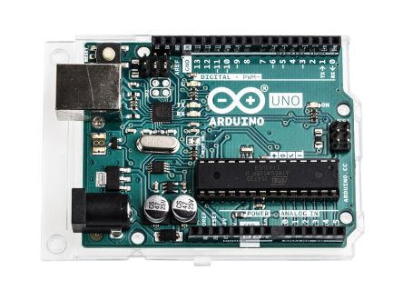

* Sensor
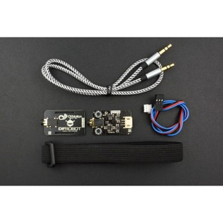 

* Optional: screen (2,8” TFT Adafruit Shield)
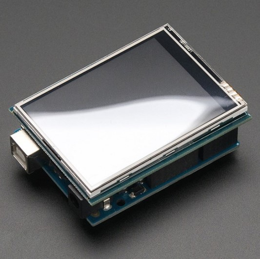

* Optional: 3D printer to print case
I printed for my project and here it is:
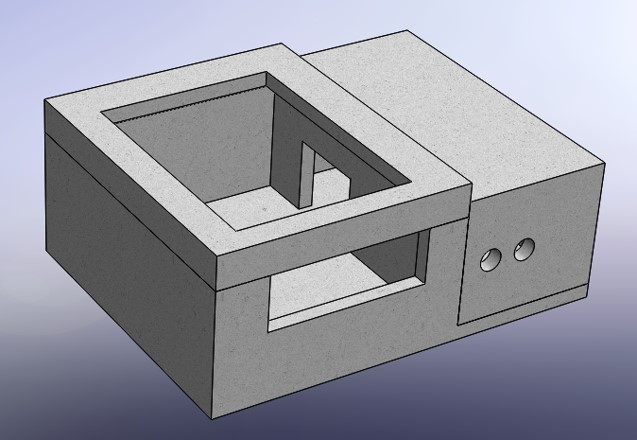
But in addition, to reduce the device I had to shorten the cables and solder some connections.


**This is my set:**
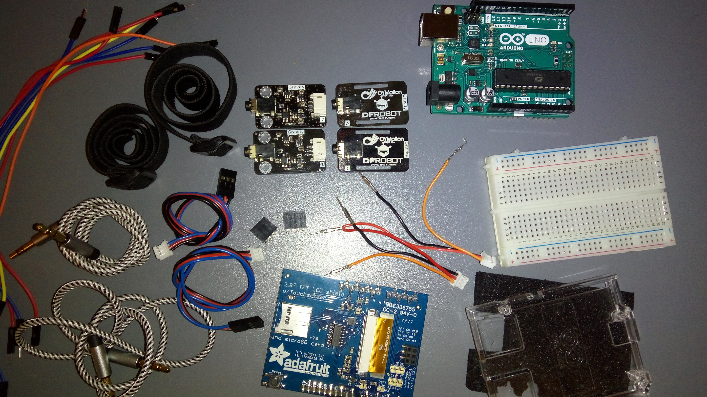

### DO IT
First you need to connect arduino and sensor, next connect with computer. You need to Arduino IDE -> https://www.arduino.cc/en/Main/Software

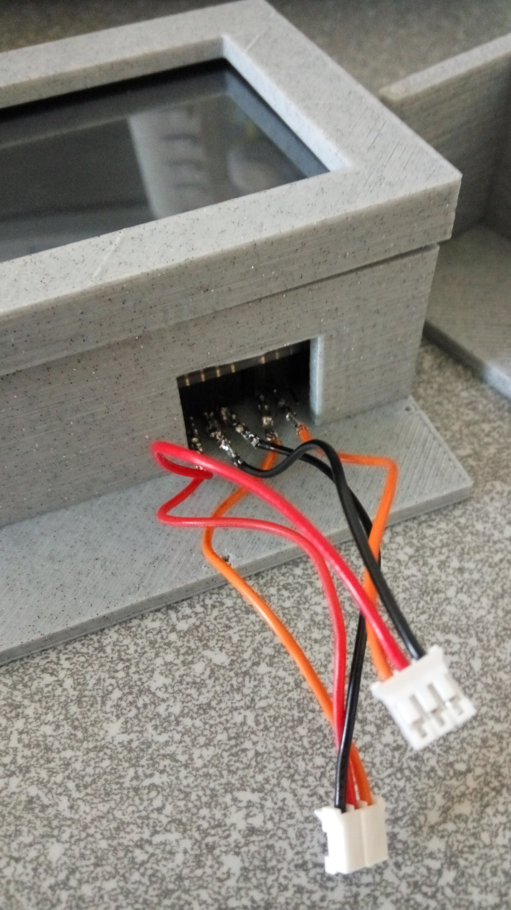
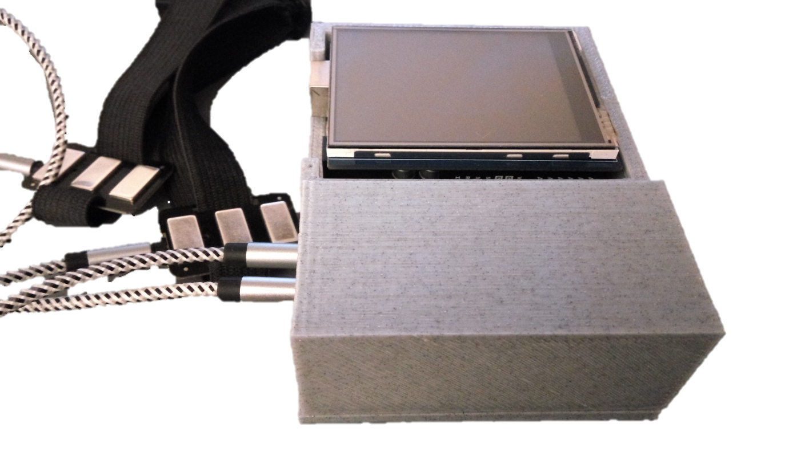

## Code in Arduino IDE
```

```
## Try it
When you have done everything above (connect and code), try it on yourself.

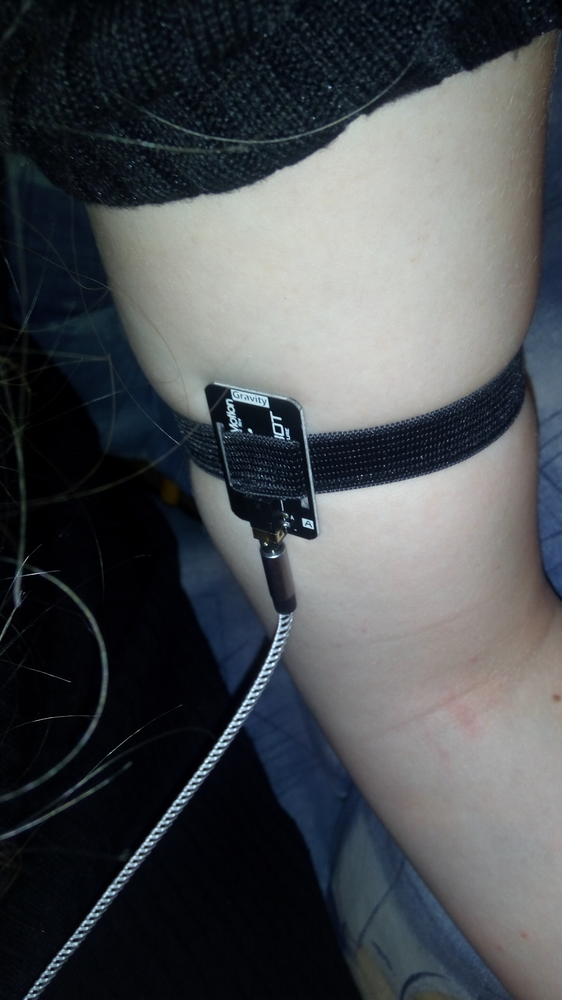


Using an elastic band, connect the electrode to the skin area of your choice. Preferably with a biceps or forearm. First, gently examine the muscle where it is located, where you feel the best contact. You can help yourself with anatomical photos.
The connection must be accurate.
Start the program, first don't move, your device calibrates. Run plotter on your computer.

 

Then try to stretch the muscle.
Next step, you can connect screen. 

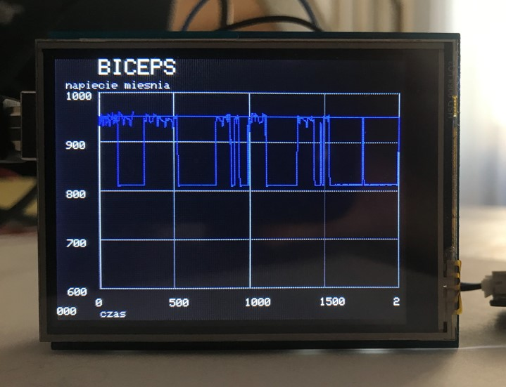

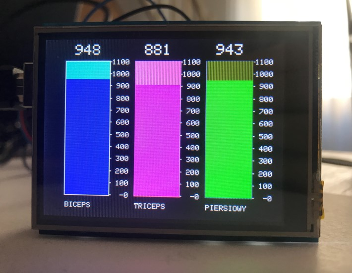


## Charts
Here are charts from my test. **Note the values of the vertical scale.** This are screens from arduino plotter. 

Not connect to the body.

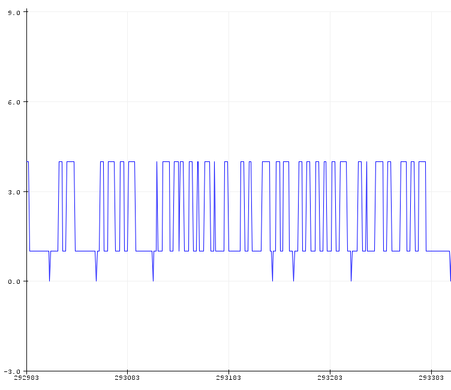

Connected to the body, strained muscles.

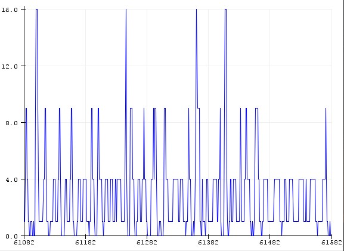

Short rapid muscle tension.

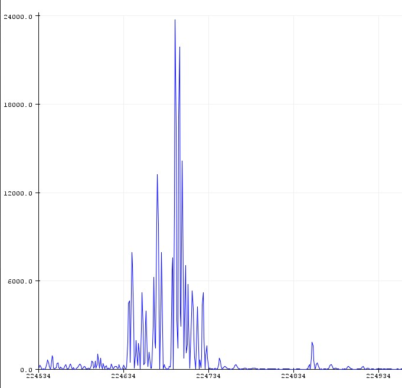

Long tension.

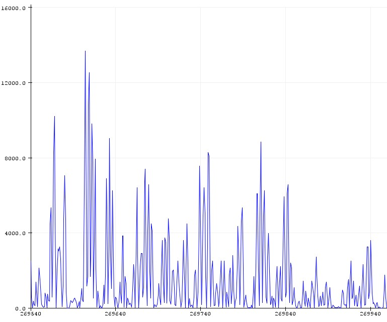

## Sources
